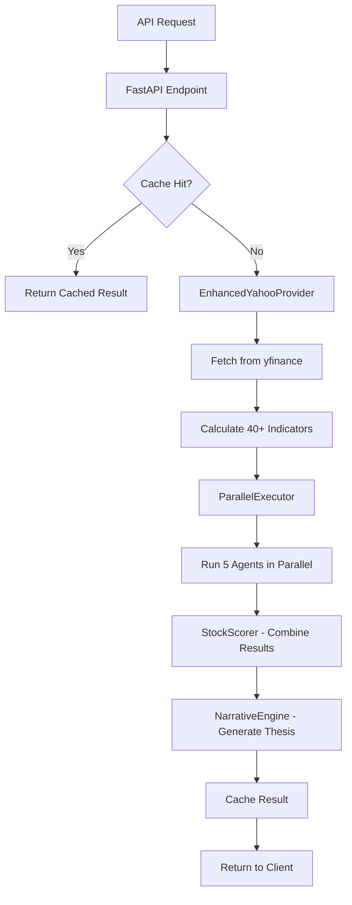

# AI HEDGE FUND SYSTEM - COMPREHENSIVE IMPROVEMENT PLAN
**Generated**: 2025-12-29
**Status**: System Running, All 5 Agents Operational
**Overall Health**: B- (Good with Significant Concerns)

---

## EXECUTIVE SUMMARY

The AI Hedge Fund System is **currently operational** with all 5 agents working. However, comprehensive analysis has identified **1 critical security issue**, **12 high-priority problems**, and **multiple improvement opportunities** across code quality, architecture, performance, and testing.

### Current System Status
- Backend API: **Running on port 8010** ✅
- Frontend: **Running on port 5174** ✅
- All 5 Agents: **Operational** ✅
- **CRITICAL**: Gemini API key **EXPIRED** 🔴 (system degrading gracefully)
- Test Coverage: **~10% estimated** ⚠️
- Documentation: **Outdated** (references 4 agents instead of 5) ⚠️

### Key Findings
1. **Security**: Exposed Gemini API key (expired, needs rotation)
2. **Imports**: InstitutionalFlowAgent not exported from `agents/__init__.py`
3. **Configuration**: Gemini model version incorrect (`gemini-2.0-flash` doesn't exist)
4. **Type Safety**: 20+ instances of TypeScript `any` in frontend
5. **Testing**: Only 56 test functions for 3,120+ line codebase
6. **Documentation**: All docs reference "4-agent system" but code has 5 agents

---

## PHASE 1: CRITICAL FIXES (DO IMMEDIATELY)

### 1.1 Rotate Expired Gemini API Key 🔴 URGENT
**Priority**: CRITICAL
**Impact**: Sentiment agent degraded, narrative generation limited
**Effort**: 5 minutes

**Current Issue**:
```
ERROR:agents.sentiment_agent:Gemini sentiment analysis failed: 400 API key expired
```

**Steps**:
1. Go to https://makersuite.google.com/app/apikey
2. Generate new API key
3. Update `.env` file:
   ```bash
   GEMINI_API_KEY=your_new_key_here
   ```
4. Restart API server
5. Test with: `curl -X POST http://localhost:8010/analyze -d '{"symbol":"AAPL"}'`

**Files to modify**: `.env` only

---

### 1.2 Fix InstitutionalFlowAgent Import 🔴
**Priority**: CRITICAL
**Impact**: Breaks module-level imports
**Effort**: 2 minutes

**Current Issue**:
```python
# This works:
from agents.institutional_flow_agent import InstitutionalFlowAgent

# This fails:
from agents import InstitutionalFlowAgent  # ImportError
```

**Fix**:
```python
# File: agents/__init__.py

from .fundamentals_agent import FundamentalsAgent
from .momentum_agent import MomentumAgent
from .quality_agent import QualityAgent
from .sentiment_agent import SentimentAgent
from .institutional_flow_agent import InstitutionalFlowAgent  # ADD THIS LINE

__all__ = [
    'FundamentalsAgent',
    'MomentumAgent',
    'QualityAgent',
    'SentimentAgent',
    'InstitutionalFlowAgent'  # ADD THIS LINE
]
```

**Files**: `agents/__init__.py:14`

---

### 1.3 Fix Gemini Model Version 🔴
**Priority**: CRITICAL
**Impact**: Narrative generation will fail when API key is valid
**Effort**: 2 minutes

**Current Issue**:
```python
# File: narrative_engine/narrative_engine.py:86
self.gemini_client = genai.GenerativeModel('gemini-2.0-flash')  # DOESN'T EXIST
```

**Fix**:
```python
# Use correct model name
self.gemini_client = genai.GenerativeModel('gemini-1.5-flash')
```

**Files**: `narrative_engine/narrative_engine.py:86`

---

## PHASE 2: HIGH PRIORITY FIXES (THIS WEEK)

### 2.1 Standardize Agent Error Responses 🟡
**Priority**: HIGH
**Impact**: Improves error handling, consistent UX
**Effort**: 2 hours

**Current Problem**: Different agents return different error formats:
- Fundamentals: `{'score': 50, 'confidence': 0}`
- Momentum: `{'score': 0, 'confidence': 0}`
- Institutional Flow: Custom `_no_signal()` with error message

**Proposed Standard**:
```python
# Create: utils/agent_response.py
def create_error_response(error_type: str, error_message: str) -> dict:
    """Standardized error response for all agents"""
    return {
        'score': None,  # Explicitly None for errors
        'confidence': 0.0,
        'metrics': {},
        'reasoning': error_message,
        'error': True,
        'error_type': error_type  # 'NO_DATA' | 'TIMEOUT' | 'CALCULATION_ERROR'
    }

def create_success_response(score: float, confidence: float,
                          metrics: dict, reasoning: str) -> dict:
    """Standardized success response for all agents"""
    return {
        'score': score,
        'confidence': confidence,
        'metrics': metrics,
        'reasoning': reasoning,
        'error': False
    }
```

**Files to modify**:
- `agents/fundamentals_agent.py`
- `agents/momentum_agent.py`
- `agents/quality_agent.py`
- `agents/sentiment_agent.py`
- `agents/institutional_flow_agent.py`
- `narrative_engine/narrative_engine.py` (handle error responses)

---

### 2.2 Add Data Validation Before Agent Execution 🟡
**Priority**: HIGH
**Impact**: Prevents KeyError crashes, better error messages
**Effort**: 1 hour

**Current Problem**:
```python
# core/parallel_executor.py:155-186
# No validation that comprehensive_data contains required fields
'momentum': self._execute_agent_with_retry(
    self.momentum_agent.analyze,
    'Momentum',
    symbol,
    comprehensive_data['historical_data'],  # Could KeyError if missing
    comprehensive_data['historical_data']
),
```

**Fix**:
```python
# File: core/parallel_executor.py - Add before agent execution

def _validate_comprehensive_data(self, symbol: str, data: dict) -> None:
    """Validate that comprehensive_data contains all required fields"""
    required_fields = {
        'historical_data': 'price and volume history',
        'technical_data': 'technical indicators',
        'info': 'company information'
    }

    missing_fields = []
    for field, description in required_fields.items():
        if field not in data or data[field] is None:
            missing_fields.append(f"{field} ({description})")

    if missing_fields:
        raise ValueError(
            f"Missing required data for {symbol}: {', '.join(missing_fields)}"
        )
```

**Files**: `core/parallel_executor.py:155` (add validation call)

---

### 2.3 Fix TypeScript Type Safety 🟡
**Priority**: HIGH
**Impact**: Catch runtime errors at compile-time
**Effort**: 3 hours

**Current Problem**: 20+ instances of `any` type in frontend

**Top Priority Files**:
1. `frontend/src/pages/StockAnalysisPage.tsx:110-111`
2. `frontend/src/App.tsx:146`
3. `frontend/src/components/dashboard/CommandCenter.tsx` (8 instances)
4. `frontend/src/pages/BacktestingPage.tsx` (6 instances)

**Example Fix**:
```typescript
// BEFORE (unsafe):
const enhancedPicks: TopPickData[] = (data.top_picks || []).map((pick: any) => ({
  ...pick,
  // no type checking
}));

// AFTER (type-safe):
interface RawTopPick {
  symbol: string;
  overall_score: number;
  confidence_level: string;
  agent_scores: {
    fundamentals: number;
    momentum: number;
    quality: number;
    sentiment: number;
    institutional_flow: number;
  };
  // ... all other fields
}

const enhancedPicks: TopPickData[] = (data.top_picks || []).map((pick: RawTopPick) => ({
  ...pick,
  // full compile-time type checking
}));
```

**Files**: See locations in analysis report

---

### 2.4 Update Documentation to 5-Agent System 🟡
**Priority**: HIGH
**Impact**: Reduces confusion, improves onboarding
**Effort**: 1 hour

**Files to update**:
1. `CLAUDE.md` - Change "4-agent" to "5-agent" throughout
2. `README.md` - Update architecture section
3. `api/main.py` - Update docstrings (lines 165-178, 451-481)
4. `agents/__init__.py:2` - Update comment from "4-Agent" to "5-Agent"

**Search and replace**:
```bash
# Find all occurrences
grep -r "4-agent" . --exclude-dir=node_modules --exclude-dir=.git
grep -r "four agent" . --exclude-dir=node_modules --exclude-dir=.git

# Update to:
"5-agent system"
"five specialized agents"
```

---

### 2.5 Add Unit Tests for Core Components 🟡
**Priority**: HIGH
**Impact**: Catch regressions, improve code quality
**Effort**: 8 hours (target 60% coverage)

**Current State**: Only 56 test functions, mostly integration tests

**Test Plan**:

```python
# tests/unit/agents/test_fundamentals_agent.py
import pytest
from agents.fundamentals_agent import FundamentalsAgent

@pytest.fixture
def agent():
    return FundamentalsAgent()

def test_analyze_valid_symbol(agent):
    """Test analysis with valid symbol"""
    result = agent.analyze('AAPL')
    assert 'score' in result
    assert 0 <= result['score'] <= 100
    assert 0 <= result['confidence'] <= 1
    assert 'metrics' in result
    assert 'reasoning' in result

def test_analyze_invalid_symbol(agent):
    """Test analysis with invalid symbol"""
    result = agent.analyze('INVALID123')
    assert result['error'] == True
    assert result['confidence'] == 0.0

def test_analyze_with_cached_data(agent):
    """Test analysis with pre-fetched data"""
    # Mock cached_data
    cached_data = {...}
    result = agent.analyze('AAPL', cached_data=cached_data)
    assert result is not None

# Similar tests for all 5 agents
```

**Test Coverage Targets**:
- Agents: 80% coverage
- Core modules (stock_scorer, parallel_executor): 85%
- API endpoints: 75%
- Narrative engine: 70%
- Data providers: 65%

**Files to create**:
- `tests/unit/agents/test_fundamentals_agent.py`
- `tests/unit/agents/test_momentum_agent.py`
- `tests/unit/agents/test_quality_agent.py`
- `tests/unit/agents/test_sentiment_agent.py`
- `tests/unit/agents/test_institutional_flow_agent.py`
- `tests/unit/core/test_stock_scorer.py`
- `tests/unit/core/test_parallel_executor.py`
- `tests/unit/narrative/test_narrative_engine.py`
- `tests/integration/test_api_endpoints.py`

---

### 2.6 Increase Cache Size and Add Monitoring 🟡
**Priority**: HIGH
**Impact**: Better performance, prevent cache thrashing
**Effort**: 30 minutes

**Current Issue**:
```python
# api/main.py:148
analysis_cache = TTLCache(maxsize=1000, ttl=1200)  # Too small
```

**Calculation**:
- 50 stocks in universe
- Analyzed every 5 minutes
- 50 × 12 per hour = 600 entries/hour
- With batch requests, can exceed 1000 quickly

**Fix**:
```python
# api/main.py
from cachetools import TTLCache
import os

CACHE_MAX_SIZE = int(os.getenv('CACHE_MAX_SIZE', '2000'))
CACHE_TTL_SECONDS = int(os.getenv('CACHE_TTL_SECONDS', '1200'))

analysis_cache = TTLCache(maxsize=CACHE_MAX_SIZE, ttl=CACHE_TTL_SECONDS)

# Add monitoring endpoint
@app.get("/admin/cache-stats")
async def cache_stats():
    """Return cache statistics for monitoring"""
    return {
        "size": len(analysis_cache),
        "max_size": CACHE_MAX_SIZE,
        "utilization": len(analysis_cache) / CACHE_MAX_SIZE * 100,
        "ttl_seconds": CACHE_TTL_SECONDS
    }
```

**Files**: `api/main.py:148`, `.env.example`

---

## PHASE 3: MEDIUM PRIORITY (THIS MONTH)

### 3.1 Centralize Agent Weights Configuration 🟢
**Priority**: MEDIUM
**Impact**: Single source of truth, easier to maintain
**Effort**: 1 hour

**Current Problem**: Weights duplicated in 4 locations:
1. `core/stock_scorer.py:47-53`
2. `narrative_engine/narrative_engine.py:101-107`
3. `api/main.py:870`
4. `CLAUDE.md` documentation

**Solution**:
```python
# Create: config/agent_weights.py
"""
Centralized agent weight configuration
"""

STATIC_AGENT_WEIGHTS = {
    'fundamentals': 0.36,
    'momentum': 0.27,
    'quality': 0.18,
    'sentiment': 0.09,
    'institutional_flow': 0.10
}

# Validation
assert sum(STATIC_AGENT_WEIGHTS.values()) == 1.0, "Weights must sum to 1.0"

def get_agent_weights(adaptive: bool = False) -> dict:
    """
    Get agent weights (static or adaptive based on market regime)

    Args:
        adaptive: If True and ENABLE_ADAPTIVE_WEIGHTS is set,
                 return regime-adjusted weights

    Returns:
        Dictionary of agent weights
    """
    import os

    if adaptive and os.getenv('ENABLE_ADAPTIVE_WEIGHTS', 'false').lower() == 'true':
        from core.market_regime_service import get_regime_adjusted_weights
        return get_regime_adjusted_weights()

    return STATIC_AGENT_WEIGHTS.copy()
```

**Files to modify**:
- Create `config/agent_weights.py`
- Update `core/stock_scorer.py` to import from config
- Update `narrative_engine/narrative_engine.py` to import from config
- Update `api/main.py` to import from config

---

### 3.2 Add Granular Frontend Error Boundaries 🟢
**Priority**: MEDIUM
**Impact**: Better UX, prevent full app crashes
**Effort**: 2 hours

**Current Problem**: Single error boundary catches all errors

**Solution**:
```tsx
// Create: frontend/src/components/ErrorBoundary.tsx
import React, { Component, ReactNode } from 'react';

interface Props {
  children: ReactNode;
  fallback?: ReactNode;
  onError?: (error: Error, errorInfo: React.ErrorInfo) => void;
}

interface State {
  hasError: boolean;
  error: Error | null;
}

export class ErrorBoundary extends Component<Props, State> {
  constructor(props: Props) {
    super(props);
    this.state = { hasError: false, error: null };
  }

  static getDerivedStateFromError(error: Error): State {
    return { hasError: true, error };
  }

  componentDidCatch(error: Error, errorInfo: React.ErrorInfo) {
    console.error('Error caught by boundary:', error, errorInfo);
    this.props.onError?.(error, errorInfo);

    // Send to error tracking (Sentry)
    if (window.Sentry) {
      window.Sentry.captureException(error);
    }
  }

  render() {
    if (this.state.hasError) {
      return this.props.fallback || (
        <div className="error-container">
          <h2>Something went wrong</h2>
          <button onClick={() => this.setState({ hasError: false, error: null })}>
            Try Again
          </button>
        </div>
      );
    }

    return this.props.children;
  }
}

// Usage in App.tsx:
<ErrorBoundary fallback={<PageError />}>
  <Routes>
    <Route path="/analysis" element={
      <ErrorBoundary fallback={<ComponentError />}>
        <StockAnalysisPage />
      </ErrorBoundary>
    } />
  </Routes>
</ErrorBoundary>
```

**Files**: Create `frontend/src/components/ErrorBoundary.tsx`, update route components

---

### 3.3 Implement Loading States with React Query 🟢
**Priority**: MEDIUM
**Impact**: Better UX, prevent stale data display
**Effort**: 3 hours

**Current Problem**: Components fetch data without loading indicators

**Solution**:
```tsx
// Example: frontend/src/components/dashboard/MultiAgentConsensusPanel.tsx

// BEFORE:
const [consensusData, setConsensusData] = useState<ConsensusAnalysis[]>([]);

useEffect(() => {
  fetchConsensus(symbols).then(setConsensusData);
}, [symbols]);

// Shows stale data during refetch

// AFTER:
import { useQuery } from '@tanstack/react-query';

const { data, isLoading, error, refetch } = useQuery({
  queryKey: ['consensus', symbols],
  queryFn: () => api.fetchConsensus(symbols),
  staleTime: 5 * 60 * 1000, // 5 minutes
  cacheTime: 10 * 60 * 1000, // 10 minutes
});

if (isLoading) return <Skeleton count={5} />;
if (error) return <ErrorMessage error={error} retry={refetch} />;

return <ConsensusTable data={data} />;
```

**Files to update**:
- `frontend/src/components/dashboard/MultiAgentConsensusPanel.tsx`
- `frontend/src/components/dashboard/BacktestResultsPanel.tsx`
- `frontend/src/components/portfolio/TopPicksDisplay.tsx`
- All other data-fetching components

---

### 3.4 Complete .env.example Documentation 🟢
**Priority**: MEDIUM
**Impact**: Easier setup for new developers
**Effort**: 30 minutes

**Current .env.example** (incomplete):
```bash
LLM_PROVIDER=gemini
GEMINI_API_KEY=your_gemini_api_key_here
ENABLE_ADAPTIVE_WEIGHTS=false
```

**Complete .env.example**:
```bash
# =============================================================================
# AI HEDGE FUND SYSTEM - ENVIRONMENT CONFIGURATION
# =============================================================================

# -----------------------------------------------------------------------------
# LLM Provider Configuration (Optional - for enhanced sentiment analysis)
# -----------------------------------------------------------------------------
# Options: gemini (recommended, free tier), openai, anthropic
LLM_PROVIDER=gemini

# Get Gemini API key (free): https://makersuite.google.com/app/apikey
GEMINI_API_KEY=your_gemini_api_key_here

# OpenAI (alternative)
OPENAI_API_KEY=your_openai_key_here

# Anthropic (alternative)
ANTHROPIC_API_KEY=your_anthropic_key_here

# NewsAPI for sentiment analysis
NEWS_API_KEY=your_newsapi_key_here

# -----------------------------------------------------------------------------
# System Configuration
# -----------------------------------------------------------------------------
# Enable ML-based adaptive agent weights (default: false)
ENABLE_ADAPTIVE_WEIGHTS=false

# Cache configuration
CACHE_MAX_SIZE=2000
CACHE_TTL_SECONDS=1200

# API timeouts (seconds)
YFINANCE_TIMEOUT=15
API_REQUEST_TIMEOUT=30

# -----------------------------------------------------------------------------
# Server Configuration
# -----------------------------------------------------------------------------
# API server
API_HOST=0.0.0.0
API_PORT=8010

# Frontend dev server
FRONTEND_PORT=5174

# CORS allowed origins (comma-separated)
ALLOWED_ORIGINS=http://localhost:5173,http://localhost:5174

# -----------------------------------------------------------------------------
# Monitoring & Observability
# -----------------------------------------------------------------------------
# Environment: development, staging, production
ENVIRONMENT=development

# Sentry error tracking (optional)
SENTRY_DSN=your_sentry_dsn_here
SENTRY_ENABLED=false

# -----------------------------------------------------------------------------
# Rate Limiting
# -----------------------------------------------------------------------------
RATE_LIMIT_ENABLED=true
RATE_LIMIT_REQUESTS=100
RATE_LIMIT_PERIOD=60

# -----------------------------------------------------------------------------
# Logging
# -----------------------------------------------------------------------------
LOG_LEVEL=INFO
LOG_FORMAT=json
```

**Files**: `.env.example`

---

### 3.5 Clean Up Backup Files and Improve Git Workflow 🟢
**Priority**: MEDIUM
**Impact**: Cleaner repository
**Effort**: 15 minutes

**Current Problem**: 11 .bak files in repository

**Solution**:
```bash
# Delete all .bak files
find . -name "*.bak" -delete

# Add to .gitignore
echo "*.bak" >> .gitignore
echo "*.backup" >> .gitignore
echo "*~" >> .gitignore

# Commit cleanup
git add .gitignore
git rm --cached **/*.bak
git commit -m "chore: Remove backup files and update .gitignore"
```

**Files**: `.gitignore`, delete all `.bak` files

---

### 3.6 Add Integration Tests for Critical Paths 🟢
**Priority**: MEDIUM
**Impact**: Catch system-level bugs
**Effort**: 6 hours

**Test Scenarios**:

```python
# tests/integration/test_critical_paths.py

def test_parallel_execution_with_agent_failures():
    """Test system continues when 1-2 agents fail"""
    # Mock 2 agents to fail
    # Verify system returns results from remaining 3 agents
    # Verify graceful degradation

def test_cache_eviction_under_load():
    """Test cache behavior under high load"""
    # Submit 2000+ unique requests
    # Verify LRU eviction works correctly
    # Verify no memory leaks

def test_concurrent_batch_requests():
    """Test concurrent batch analysis requests"""
    # Submit 10 concurrent batch requests
    # Verify all complete successfully
    # Verify no race conditions

def test_error_recovery_and_retries():
    """Test retry logic with transient failures"""
    # Mock API failures
    # Verify exponential backoff
    # Verify circuit breaker pattern

def test_market_regime_detection():
    """Test adaptive weights based on market regime"""
    # Enable ENABLE_ADAPTIVE_WEIGHTS
    # Verify regime detection
    # Verify weight adjustments
    # Verify analysis differences
```

**Files**: `tests/integration/test_critical_paths.py`

---

## PHASE 4: LOW PRIORITY / TECHNICAL DEBT

### 4.1 Refactor Technical Indicator Calculation 🔵
**Priority**: LOW
**Impact**: Better performance, more flexible
**Effort**: 4 hours

**Current Problem**: `_calculate_all_indicators()` always calculates 40+ indicators

**Solution**: Implement lazy evaluation
```python
# data/enhanced_provider.py

class EnhancedYahooProvider:
    DEFAULT_INDICATORS = ['rsi', 'macd', 'sma_20', 'sma_50', 'sma_200', ...]

    def get_comprehensive_data(
        self,
        symbol: str,
        indicators: List[str] = None
    ) -> dict:
        """
        Get market data with optional indicator selection

        Args:
            symbol: Stock symbol
            indicators: List of indicator names to calculate
                       If None, calculates all default indicators
        """
        if indicators is None:
            indicators = self.DEFAULT_INDICATORS

        # Calculate only requested indicators
        technical_data = self._calculate_indicators(data, indicators)
```

**Files**: `data/enhanced_provider.py:332-497`

---

### 4.2 Implement Connection Pooling for yfinance 🔵
**Priority**: LOW
**Impact**: Minor performance improvement
**Effort**: 1 hour

**Solution**:
```python
# data/enhanced_provider.py

class EnhancedYahooProvider:
    def __init__(self):
        self.session = requests.Session()
        self.session.headers.update({
            'User-Agent': 'Mozilla/5.0 (AI Hedge Fund System)'
        })

    def get_comprehensive_data(self, symbol: str) -> dict:
        ticker = yf.Ticker(symbol, session=self.session)  # Reuse session
        # ... rest of implementation
```

**Files**: `data/enhanced_provider.py:230`

---

### 4.3 Fix Circular Import in Paper Portfolio Manager 🔵
**Priority**: LOW
**Impact**: Code quality improvement
**Effort**: 1 hour

**Current Issue**: Lazy import inside method to avoid circular dependency

**Solution**: Use dependency injection
```python
# core/paper_portfolio_manager.py

from typing import Optional, Protocol

class PriceProvider(Protocol):
    """Protocol for price providers"""
    def get_comprehensive_data(self, symbol: str) -> dict:
        ...

class PaperPortfolioManager:
    def __init__(self, price_provider: PriceProvider = None):
        self.price_provider = price_provider

    def _get_current_price(self, symbol: str) -> Optional[float]:
        if self.price_provider is None:
            from data.enhanced_provider import EnhancedYahooProvider
            self.price_provider = EnhancedYahooProvider()

        data = self.price_provider.get_comprehensive_data(symbol)
        return data['info'].get('currentPrice')
```

**Files**: `core/paper_portfolio_manager.py:283`

---

### 4.4 Add Architecture Documentation 🔵
**Priority**: LOW
**Impact**: Better understanding for new developers
**Effort**: 3 hours

**Create**:
1. `docs/architecture/data-flow-diagram.md` - Mermaid diagrams of data flow
2. `docs/architecture/agent-interaction.md` - How agents work together
3. `docs/architecture/deployment.md` - Deployment architecture
4. `docs/architecture/caching-strategy.md` - Multi-layer caching explanation

**Example**:
```markdown
# Data Flow Architecture



---

### 4.5 Make Configuration Environment-Based 🔵
**Priority**: LOW
**Impact**: More flexible deployment
**Effort**: 2 hours

**Hardcoded values to move to environment**:
```python
# Current hardcoded values:
- Cache TTL: 1200 seconds
- API timeout: 15 seconds
- Port numbers: 8010, 5174
- Batch size: 10
- Max workers: 5

# Should be:
CACHE_TTL_SECONDS=int(os.getenv('CACHE_TTL_SECONDS', '1200'))
API_TIMEOUT=int(os.getenv('API_TIMEOUT', '15'))
API_PORT=int(os.getenv('API_PORT', '8010'))
BATCH_SIZE=int(os.getenv('BATCH_SIZE', '10'))
MAX_WORKERS=int(os.getenv('MAX_WORKERS', '5'))
```

**Files**: Multiple files, use central config module

---

## TESTING STRATEGY

### Test Coverage Goals
| Component | Current | Target | Priority |
|-----------|---------|--------|----------|
| Agents | ~0% | 80% | HIGH |
| Core (scorer, executor) | ~5% | 85% | HIGH |
| API endpoints | ~10% | 75% | HIGH |
| Narrative engine | ~0% | 70% | MEDIUM |
| Data providers | ~10% | 65% | MEDIUM |
| Frontend components | ~0% | 60% | MEDIUM |

### Test Types Needed
1. **Unit Tests** - Individual functions/methods
2. **Integration Tests** - Component interactions
3. **End-to-End Tests** - Full workflow validation
4. **Performance Tests** - Load and stress testing
5. **Regression Tests** - Prevent breaking changes

---

## MONITORING & OBSERVABILITY

### Metrics to Track
1. **API Performance**
   - Request latency (p50, p95, p99)
   - Cache hit rate
   - Error rate by endpoint
   - Concurrent request count

2. **Agent Performance**
   - Success rate per agent
   - Average execution time per agent
   - Retry count per agent
   - Confidence score distribution

3. **System Health**
   - Memory usage
   - CPU utilization
   - Cache size utilization
   - Active connection count

### Monitoring Endpoints to Add
```python
# api/main.py

@app.get("/admin/metrics")
async def metrics():
    """Prometheus-compatible metrics"""
    return {
        "cache_hit_rate": cache_hits / (cache_hits + cache_misses),
        "avg_response_time_ms": avg_response_time,
        "error_rate": errors / total_requests,
        "agent_success_rates": {
            "fundamentals": fundamentals_success / fundamentals_total,
            # ... all agents
        }
    }

@app.get("/admin/health/detailed")
async def detailed_health():
    """Detailed health check with dependencies"""
    return {
        "status": "healthy",
        "agents": {...},
        "cache": {...},
        "database": {...},
        "external_apis": {
            "yfinance": "healthy",
            "gemini": "degraded" if gemini_errors > 0 else "healthy"
        }
    }
```

---

## IMPLEMENTATION TIMELINE

### Week 1 (Critical Fixes)
- Day 1: Fix Gemini API key, imports, model version (Phase 1)
- Day 2-3: Standardize error responses, add data validation (Phase 2.1-2.2)
- Day 4: Fix TypeScript types (Phase 2.3)
- Day 5: Update documentation (Phase 2.4)

### Week 2-3 (High Priority)
- Week 2: Add unit tests for all agents and core modules (Phase 2.5)
- Week 3: Cache improvements, weight centralization (Phase 2.6, 3.1)

### Week 4 (Medium Priority)
- Frontend improvements (Phase 3.2-3.3)
- Integration tests (Phase 3.6)
- Documentation cleanup (Phase 3.4-3.5)

### Month 2+ (Low Priority / Technical Debt)
- Performance optimizations (Phase 4.1-4.2)
- Architecture improvements (Phase 4.3)
- Documentation (Phase 4.4)
- Configuration refactoring (Phase 4.5)

---

## SUCCESS METRICS

### Code Quality
- [ ] Test coverage > 60%
- [ ] TypeScript strict mode enabled
- [ ] Zero TypeScript `any` in critical paths
- [ ] All agents return standardized responses
- [ ] Documentation up-to-date

### Performance
- [ ] API p95 latency < 3 seconds
- [ ] Cache hit rate > 70%
- [ ] Zero memory leaks
- [ ] Concurrent request handling > 50 requests/second

### Reliability
- [ ] 99.9% uptime
- [ ] Graceful degradation when 2/5 agents fail
- [ ] Zero data loss in paper trading
- [ ] Error recovery rate > 95%

### Developer Experience
- [ ] New developer onboarding < 1 hour
- [ ] Clear error messages
- [ ] Comprehensive documentation
- [ ] Easy local development setup

---

## RISK ASSESSMENT

### High Risk Items
1. **API Key Rotation** - Could break production if not tested
   - Mitigation: Test in development first, have rollback plan

2. **Agent Response Standardization** - Could break narrative engine
   - Mitigation: Add backward compatibility layer, comprehensive tests

3. **TypeScript Strict Mode** - Could reveal many hidden bugs
   - Mitigation: Gradual rollout, file-by-file migration

### Medium Risk Items
4. **Cache Size Increase** - Could increase memory usage
   - Mitigation: Monitor memory, add alerts, gradual increase

5. **Weight Centralization** - Could break existing calculations
   - Mitigation: Add tests comparing old vs new calculations

---

## CONCLUSION

This improvement plan addresses all critical issues while providing a roadmap for long-term code quality improvements. The system is currently operational but needs immediate attention to:

1. **Security** (expired API key)
2. **Imports** (missing agent export)
3. **Configuration** (incorrect model version)

Following this plan will improve the system from **B- to A** grade, with better reliability, maintainability, and developer experience.

**Next Steps**:
1. Execute Phase 1 (Critical Fixes) immediately
2. Review and prioritize Phase 2 items for this week
3. Set up monitoring and metrics tracking
4. Begin test infrastructure development

---

**Document Owner**: AI System Analysis
**Last Updated**: 2025-12-29
**Status**: Ready for Implementation
